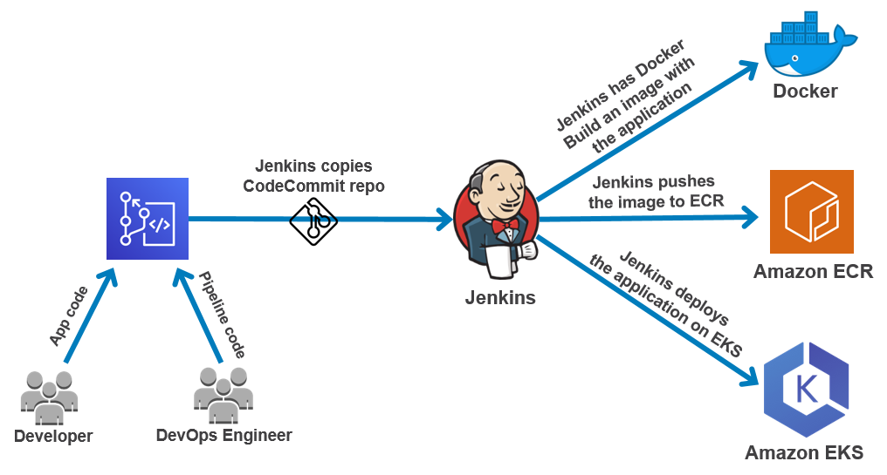
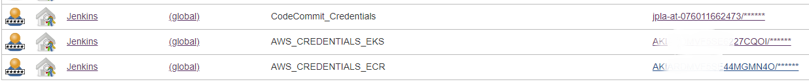
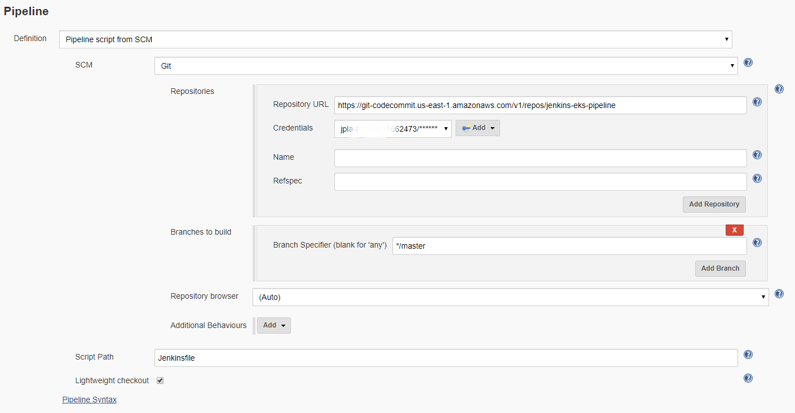

Jenkins EKS Pipeline
------------------

This Jenkins pipeline deploys a web application in Amazon Elastic Kubernetes Service using CodeCommit for version control and Amazon ECR for container registry. 



**Jenkins Pipeline Steps**

1. Download code from CodeCommit repository
2. Create container image
3. Push container image to Amazon ECR
4. Deploy application in Amazon EKS

Note - The pipeline does not have a test stage yet but you can implement it later based on the application you will be running. 

**Requirements**

* Create two repositories in CodeCommit. One for the application code and the other one for the Jenkins pipeline
* Create ECR registry
* Create password credentials in Jenkins for CodeCommit, ECR and EKS

   
 * Create Jenkins pipeline and add the CodeCommit repository URL in the SCM section
 
   
* Create EKS Cluster in AWS and node groups
* [Install kubectl on Jenkins machine to connect to AWS EKS cluster](https://docs.aws.amazon.com/eks/latest/userguide/install-kubectl.html)
* [Install AWS IAM authenticator](https://docs.aws.amazon.com/eks/latest/userguide/install-aws-iam-authenticator.html)


**Jenkinsfile**

Before running the pipeline you will have to change the value of some of the environment variables in the [Jenkinsfile](Jenkinsfile). Update the CodeCommit repository and ECR registry address. Also, make sure that the names of the Jenkins credentials and the EKS cluster are correct.  
```
 environment {
        codecommit_login = credentials('CodeCommit_Credentials')
        codecommit_repository_address='git-codecommit.us-east-1.amazonaws.com/v1/repos/aws-django-app'
        ecr_repository_address='076011662473.dkr.ecr.us-east-1.amazonaws.com/aws_app'
        aws_keys_ecr=credentials('AWS_CREDENTIALS_ECR')
        aws_keys_eks=credentials('AWS_CREDENTIALS_EKS')
        aws_region='us-east-1'
        eks_cluster_name='EKS_CLUSTER'
    }
```


**Kubernetes Objects**

You can find the Kubernetes deployment and service inside the deploy folder - [aws_app_deployment.yml](deploy/aws_app_deployment.yml) [loadbalancer_aws_app.yml](deploy/loadbalancer_aws_app.yml)


**Application Code**

You could use the AWS dashboard application in my [django-aws-app-container](https://github.com/sudopla/django-aws-app-container/tree/master/app_code) repository to test this pipeline. Upload the code to CodeCommit and then specify the address in the Jenkinsfile as showed before.

If you want to run a different applicaitont then you will have to add the new Dockerfile and other required files to the following folder [jenkins-eks-pipeline/build/container](jenkins-eks-pipeline/build/container)


