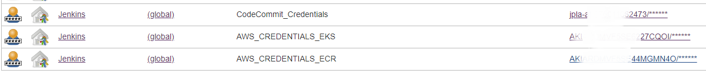

Jenkins EKS Pipeline
------------------

This Jenkins pipeline deploys a web application in Amazon Elastic Kubernetes Service using CodeCommit for version control and Amazon ECR for container registry. 


**Jenkins Pipeline Steps**

1. Download code from CodeCommit repository
2. Create container image
3. Push container image to Amazon ECR
4. Deploy application in Amazon EKS

Note - The pipeline does not have a test stage yet but you can implement it later based on the application you will be running. 

**Requirements**

* Create two repositories in CodeCommit. One for the application code and the other one for the Jenkins pipeline
* Create ECR registry
- Create password credentials in Jenkins for CodeCommit, ECR and EKS
  
 - Create Jenkins pipeline and add the CodeCommit repository URL in the SCM section
  
- Create EKS Cluster in AWS and node groups
- [Install kubectl on Jenkins machine to connect to AWS EKS cluster](https://docs.aws.amazon.com/eks/latest/userguide/install-kubectl.html)
- [Install AWS IAM authenticator](https://docs.aws.amazon.com/eks/latest/userguide/install-aws-iam-authenticator.html)

**Jenkinsfile**

Before running the pipeline you will have to change some of the values in the environment variables. Update the CodeCommit repository and ECR registry address. Also, make sure that the names of the Jenkins credentials and the EKS cluster are correct.  
```
 environment {
        codecommit_login = credentials('CodeCommit_Credentials')
        codecommit_repository_address='git-codecommit.us-east-1.amazonaws.com/v1/repos/aws-django-app'
        ecr_repository_address='076011662473.dkr.ecr.us-east-1.amazonaws.com/aws_app'
        aws_keys_ecr=credentials('AWS_CREDENTIALS_ECR')
        aws_keys_eks=credentials('AWS_CREDENTIALS_EKS')
        aws_region='us-east-1'
        eks_cluster_name='EKS_CLUSTER'
    }
```

